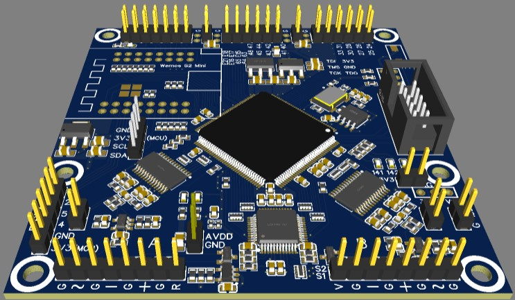

# FPGA Playground

## Analogue Acquisition Board

### Specifications

- Cyclone 2 EP2C5T144 FPGA
- 24MHz Osc
- Dual 8 Bit 100 MSPS ADC
- Dual 8 Bit 125 MSPS DAC

### Pin-Out

#### ADC and DAC Pinout

|       | CLK | D7  | D6  | D5  | D4  | D3  | D2  | D1  | D0  |
|-------|-----|-----|-----|-----|-----|-----|-----|-----|-----|
| DAC-A | 92  | 87  | 86  | 81  | 80  | 79  | 76  | 74  | 73  |
| ADC-A | 122 | 121 | 120 | 119 | 118 | 115 | 114 | 113 | 112 |
| DAC-B | 137 | 136 | 135 | 134 | 133 | 132 | 129 | 126 | 125 |
| ADC-B | 93  | 94  | 96  | 97  | 99  | 100 | 101 | 103 | 104 |

#### ESP32-FPGA Communication Pinout

SPI Bus - ESP32 as master

|      | FPGA | ESP32 |
|------|------|-------|
| MISO | 57   | 37    |
| MOSI | 53   | 35    |
| SCK  | 55   | 36    |
| CS   | 52   | 34    |

General Purpose Pins

|      | FPGA | ESP32 |
|------|------|-------|
|      | 72   | 11    |
|      | 71   | 10    |
|      | 70   | 12    |
|      | 67   | 13    |
|      | 69   | 14    |
|      | 59   | 39    |
|      | 60   | 40    |
|      | 58   | 38    |
|      | 51   | 33    |

#### PMOD Connector Pinout

#### Analog In/Out Headers

#### Misc 

## Fun with Verilog
